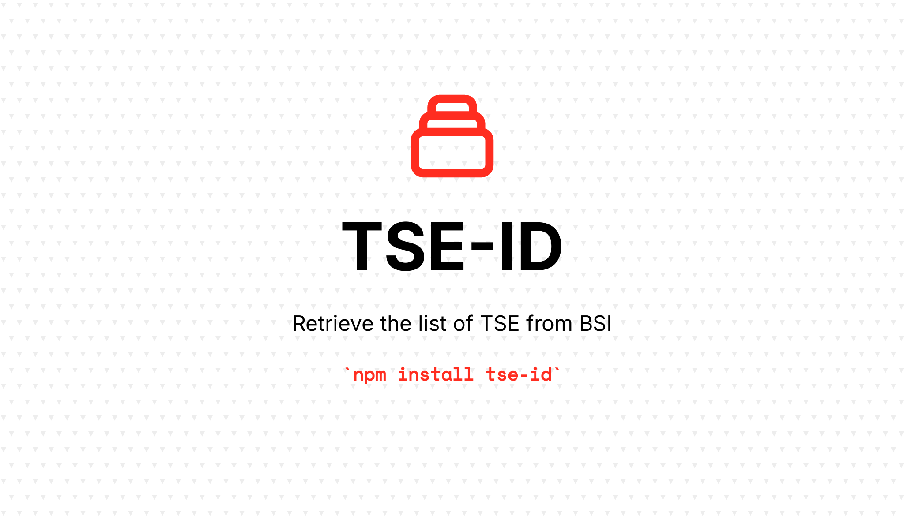

[](https://github.com/rechtlogisch/tse-id-js/actions/workflows/run-tests.yml)
[](https://www.npmjs.com/package/tse-id-js)

# tse-id-js

> Retrieves a list of TSE from BSI

## Installation

You can install the package via npm:

```bash
npm install tse-id
```

## Usage

### Command Line

```bash
# Basic usage - output to stdout
npx tse-id

# Pretty print output
npx tse-id --pretty

# Save to file
npx tse-id --output data.json

# Pretty print and save to file
npx tse-id --output data.json --pretty
```

#### CLI Options

- `-o, --output <file>`: Output file path (default: stdout)
- `-p, --pretty`: Pretty print JSON output
- `-h, --help`: Show help message

### Programmatic

```javascript
const { retrieve } = require('tse-id');

const data = await retrieve();
console.log(data);
```

```javascript
const { Retrieve } = require('tse-id');

const retrieve = new Retrieve({
  timeout: 30000,
  pages: 3,
});

const data = await retrieve.withRetry();
```

#### Options

```typescript
interface Options {
  url: string;     // Base URL for retrieving (default: BSI TSE page)
  timeout: number; // Timeout in milliseconds (default: 30000)
  pages?: number;  // Maximum pages to retrieve (optional - auto-detection used by default)
}
```

### TypeScript

```typescript
import { retrieve, List } from 'tse-id';

const data: List = await retrieve();
```

## Output Format

The package outputs data in the following JSON structure:

```json
{
  "0123-2000": {
    "id": "0123",
    "year": "2000",
    "content": "Details",
    "manufacturer": "Manufacturer",
    "date_issuance": "01.01.2000"
  },
  ...
}
```

## GitHub Actions Integration

```yaml
name: Retrieve
on:
  schedule:
    - cron: '0 5,17 * * *'  # Daily at 5 AM and 5 PM UTC

jobs:
  retrieve:
    runs-on: ubuntu-latest
    steps:
      - uses: actions/checkout@v5
      - uses: actions/setup-node@v5
        with:
          node-version: '22'
          cache: 'npm'
      - run: npm install tse-id
      - run: npx tse-id --output list.json --pretty
      - uses: actions/upload-artifact@v4
        with:
          name: list
          path: list.json
```

### Testing

```bash
# Run basic tests
npm test

# Run tests with coverage
npm run test:coverage

# Run integration tests
npm run test:external
```

## Changelog

Please see [CHANGELOG](CHANGELOG.md) for more information on what has changed recently.

## Contributing

Please see [CONTRIBUTING](https://github.com/rechtlogisch/.github/blob/main/CONTRIBUTING.md) for details.

## Security Vulnerabilities

If you discover any security-related issues, please email open-source@rechtlogisch.de instead of using the issue tracker.

## Credits

- [Krzysztof Tomasz Zembrowski](https://github.com/zembrowski)
- [All Contributors](../../contributors)

## License

The MIT License (MIT). Please see [License File](LICENSE.md) for more information.
